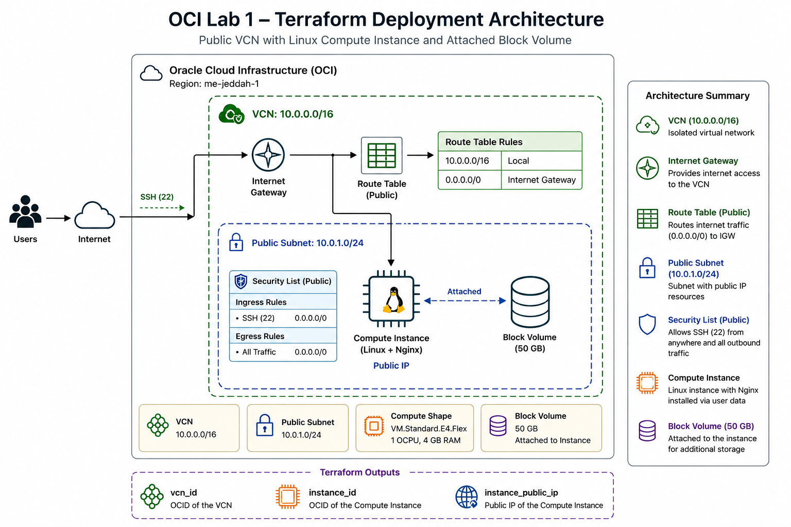

# OCI Lab 1 - Terraform Deployment

This Terraform project provisions a simple Oracle Cloud Infrastructure (OCI) environment with a public virtual cloud network, a public subnet, a Linux compute instance, and an attached block volume.

## Architecture



## What this deployment creates

The configuration deploys the following resources:

- A VCN with a CIDR block of 10.0.0.0/16
- An Internet Gateway and a public route table
- A public subnet with SSH access allowed from the internet
- A Linux compute instance
- A 50 GB block volume attached to the instance
- Outputs for the VCN ID, instance ID, and public IP

## Project structure

- provider.tf: Configures the OCI Terraform provider and region
- variables.tf: Declares all input variables used by the deployment
- vcn.tf: Creates the VCN, Internet Gateway, and public route table
- subnet.tf: Creates the public subnet and security list
- compute.tf: Creates the compute instance
- storage.tf: Creates and attaches a block volume to the instance
- outputs.tf: Exposes useful resource identifiers after deployment
- terraform.tfvars: Stores the actual values for the deployment

## Required configuration

Before applying this configuration, make sure the following values are set correctly:

- compartment_id: The OCI compartment OCID where resources will be created
- region: The OCI region to deploy into
- ssh_public_key: Your public SSH key for connecting to the instance
- instance_image_id: The OCI image OCID for the desired Linux image

The current configuration uses:

- Region: me-jeddah-1
- VCN CIDR: 10.0.0.0/16
- Public subnet CIDR: 10.0.1.0/24
- Compute shape: VM.Standard.E4.Flex
- OCPUs: 1
- Memory: 4 GB

## How to deploy

1. Initialize Terraform:

    ```bash
    terraform init
    ```

2. Review the planned changes:

    ```bash
    terraform plan
    ```

3. Apply the configuration:

    ```bash
    terraform apply
    ```

4. Get the public IP address of the instance:
    ```bash
    terraform output instance_public_ip
    ```

## Network behavior

The instance is placed in a public subnet and assigned a public IP address. The security list allows inbound SSH traffic on port 22 from anywhere and allows outbound traffic to the internet.

## Instance setup

The compute instance is configured with user data to install and start Nginx. Once the instance is running, you can open the public IP in a browser and see the default welcome page served by Nginx.

## Outputs

After deployment, the following outputs are available:

- vcn_id: The ID of the created VCN
- instance_id: The OCID of the compute instance
- instance_public_ip: The public IP address assigned to the instance
